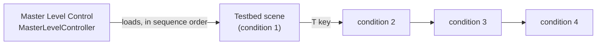
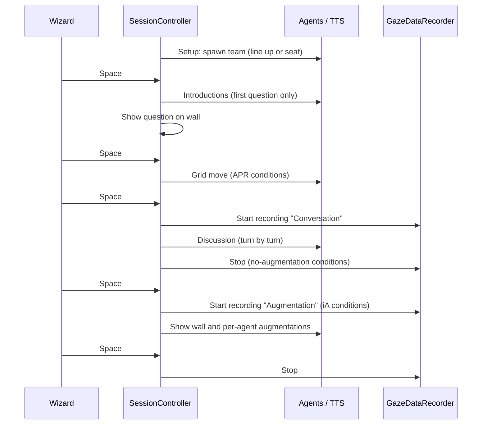

# Architecture

How the testbed's main components fit together. All study scripts are in `Assets/Testbed/Scripts/`.

## Scene flow

`MasterLevelController` lives in the entry scene and persists across scene loads. It holds the participant ID, the chosen condition sequence and the four avatar teams, and loads one `Testbed` scene per condition. Each `Testbed` scene contains a `SessionController` that runs that condition's four questions.

## Components

| Component | Responsibility |
|---|---|
| `MasterLevelController` | Study flow: participant ID, condition order (four rotated sequences), avatar teams A–D fixed to trial positions, team validation, loading condition scenes |
| `SessionController` | One condition: loads `Resources/Manuscripts/<condition>.json`, checks the scene matches the planned condition, spawns the team's avatars, and runs the phases of each question |
| `ConversationalAgentsManager` | Plays a conversation: a list of (agent, line) steps spoken one after another |
| `ConversationalAgent` | One avatar: its lines, talking animation, and speech requests |
| `CrossPlatformTTS` | Speech synthesis: runs `piper.exe` with the avatar's voice model, caches clips, and normalizes loudness at playback |
| `AgentLipSyncBridge` | Connects the avatar's audio to Oculus LipSync for mouth movement |
| `GridGenerator` | Draws the 5 × 4 opinion grid and converts grid cells to world positions |
| `AgentAugmentationInteracter` | Shows an avatar's AR panel when the head ray dwells on it for 0.3 s |
| `GazeDataRecorder` | Detects head-gaze fixations on avatars and the back wall and writes them to CSV |
| `MRUKSceneManager` | Experimental: aligns the floor and wall with the real room via MR Utility Kit (prototype scene only) |

Editor tools in `Scripts/Editor/`: the SessionController inspector, *Tools → iXR → Assign Proposed Avatar Teams*, and *Tools → iXR → Bake All Session Audio*.

## One question, phase by phase

## Speech pipeline

1. `SessionController` gives each `ConversationalAgent` its lines from the manuscript.
2. `CrossPlatformTTS` checks its in-memory cache. On a miss, it runs `piper.exe` with the avatar's voice model and speaking-rate setting, and loads the resulting WAV.
3. The clip's speech loudness is measured once, and playback volume is set so every voice plays at the same level (−20 dBFS).
4. Oculus LipSync analyses the playing audio and drives the avatar's mouth.

Each avatar prefab sets its voice file and a calibrated `lengthScale`, so all voices speak at about 4.9 syllables per second. The cache is cleared between conditions.

## Study-integrity safeguards

- **Condition check.** A `Testbed` scene halts if its Study Condition differs from what the master sequence expects.
- **Team validation.** Avatar teams are all-or-nothing: if any team is incomplete or shares an avatar with another, team lookup is disabled for every condition, with errors in the Console.
- **Test mode.** When enabled, the wall shows `[TEST MODE]` so it cannot go unnoticed.
- **Data safety.** CSV files are timestamped, and rows are never appended under a header with different columns.
